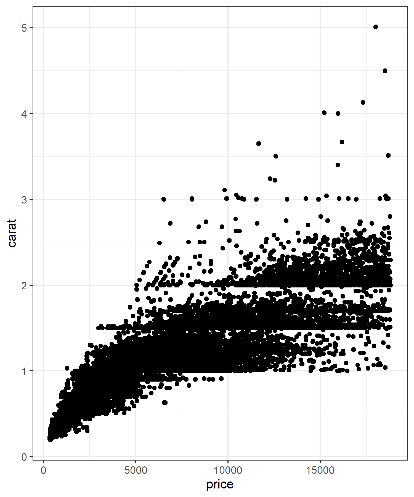

Environmental Data Science

Presentations
========================================================
author: FES 611a
date: 16 December 2019
autosize: true

[title of presentation] - YourName
========================================================
Describe your project here and insert figures; Type  to insert the image filename.png
Here, image named `EDSoutput_trial.png` is in the same folder. You can resize the images like so

More options to define image size [here](https://sebastiansauer.github.io/figure_sizing_knitr/)

*single asterisk gives bold*
**double asterisk gives italics**
## pound symbols are headers
### no of pound symbols  = size of header
 - space-hyphen-space gives you bulleted points

More formatting information is available [**here**](https://rpubs.com/SameerMathur/RPres-Tutorial); Github upload link: [**here**](https://github.com/akshaysurendra/EDS611a)

[title of presentation] - Hope
========================================================
 - Question:
 - Technical Challenge:
 - Solution:

[title of presentation] - Zhinan
========================================================
 - Question:
 - Technical Challenge:
 - Solution:

[title of presentation] - Holly
========================================================
 - Question:
 - Technical Challenge:
 - Solution:

[title of presentation] - Christopher
========================================================
 - Question:
 - Technical Challenge:
 - Solution:

[title of presentation] - Angus
========================================================
 - Question:
 - Technical Challenge:
 - Solution:

[title of presentation] - Katie
========================================================
 - Question:
 - Technical Challenge:
 - Solution:

[title of presentation] - Khin
========================================================
 - Question:
 - Technical Challenge:
 - Solution:

[title of presentation] - Austin
========================================================
 - Question:
 - Technical Challenge:
 - Solution:

[title of presentation] - Akshay
========================================================
 - Question:
 - Technical Challenge:
 - Solution:
